# 🚀 Interactive Portfolio

> A dual-mode interactive portfolio built with **SvelteKit 5**, **Threlte** (Three.js), and a **FastAPI** backend — featuring a hacker-style Terminal interface and a flashy 3D Scene GUI.

[](https://kit.svelte.dev)
[](https://threlte.xyz)
[](https://fastapi.tiangolo.com)
[](https://vercel.com)
[](LICENSE)

---

## ✨ Features

| Mode | Theme | Description |
|------|-------|-------------|
| 🖥️ **Terminal** | Dark (Cyber) | Hacker-style CLI interface with animated prompts |
| 🌐 **3D Scene** | Light (Flashy) | Immersive Three.js/Threlte 3D environment |

- **GitHub Learning Tracker** — Live GitHub activity feed via the GitHub REST API
- **DSA Graph Visualizer** — Interactive data structure animations
- **DevOps Server Rack** — Animated 3D server rack visualization
- **Dual-mode toggle** — Smooth animated transitions between modes
- **Svelte 5 Runes** — Reactive global state with `$state`

---

## 🗂️ Project Structure

```
portfolio/
├── src/
│   ├── lib/
│   │   ├── components/
│   │   │   ├── Terminal.svelte       # Cyber terminal UI
│   │   │   ├── Scene.svelte          # Threlte 3D canvas wrapper
│   │   │   ├── SceneContent.svelte   # 3D scene objects & animations
│   │   │   └── GitHubTracker.svelte  # GitHub activity feed
│   │   ├── state.svelte.ts           # Global Svelte 5 $state
│   │   └── index.ts                  # Barrel exports
│   ├── routes/
│   │   ├── +layout.ts                # SvelteKit layout config
│   │   └── +page.svelte              # Entry page
│   ├── app.html                      # HTML shell
│   └── app.css                       # Global styles
├── api/
│   ├── index.py                      # FastAPI backend (Vercel serverless)
│   └── requirements.txt              # Python dependencies
├── static/                           # Static assets
├── vercel.json                       # Vercel routing + function config
├── svelte.config.js                  # SvelteKit static adapter
├── vite.config.ts                    # Vite config w/ Tailwind
└── package.json
```

---

## 🏗️ High-Level Architecture

```mermaid
graph TB
    subgraph Client["🌐 Browser"]
        UI["SvelteKit 5 App"]
        Terminal["🖥️ Terminal Mode\n(Dark / Cyber)"]
        Scene["🌐 3D Scene Mode\n(Light / Flashy)"]
        State["state.svelte.ts\n$state runes"]
        UI -- "mode: terminal" --> Terminal
        UI -- "mode: scene" --> Scene
        Terminal & Scene --> State
    end

    subgraph API["⚡ API Layer"]
        FastAPI["FastAPI\n(api/index.py)"]
        GH["GitHub REST API\n(public)"]
    end

    subgraph CDN["📦 CDN / Static"]
        Assets["Vite Build Output\n(build/)"]
        Three["Three.js / Threlte\nbundled assets"]
    end

    UI -- "/api/*" --> FastAPI
    FastAPI -- "GET /users/:user/events" --> GH
    GH -- "JSON activity feed" --> FastAPI
    FastAPI -- "JSON response" --> UI
    Assets --> UI
    Three --> UI
```



---

## ⚙️ How It Works — Runtime Flow

This diagram shows exactly what happens from the moment a user opens the site to data being rendered on screen.


---

## 🧠 Why This Architecture?

The architecture was designed around three constraints: **performance**, **simplicity**, and **future extensibility**.

```mermaid
flowchart TD
    Goal(["🎯 Goal: Fast, Impressive,\nExtensible Portfolio"])

    Goal --> Q1{Heavy 3D\nrequired?}
    Q1 -- Yes --> A1["Need minimal JS overhead\nfor smooth WebGL loops"]
    A1 --> D1["✅ Svelte 5 compiles away\n— no runtime VDOM diff"]

    Goal --> Q2{Two distinct\nvisual modes?}
    Q2 -- Yes --> A2["Need granular reactive state\nwithout prop-drilling"]
    A2 --> D2["✅ Svelte 5 $state runes\n— module-level reactivity"]

    Goal --> Q3{Live GitHub\ndata needed?}
    Q3 -- Yes --> A3["GitHub API has CORS limits\n— needs a proxy/backend"]
    A3 --> D3["✅ FastAPI serverless function\n— runs free on Vercel"]

    Goal --> Q4{Future ML\nfeatures?}
    Q4 -- Possibly --> A4["ML ecosystem = Python\n— need Python backend"]
    A4 --> D4["✅ FastAPI already Python\n— just add torch/sklearn"]

    Goal --> Q5{Deployment\ncost/ops?}
    Q5 -- Minimal --> A5["Static site + serverless\n= zero server management"]
    A5 --> D5["✅ Vercel CDN + Python\nServerless Functions"]

    D1 & D2 & D3 & D4 & D5 --> Result(["🏆 SvelteKit 5 + Threlte\n+ FastAPI on Vercel"])
```



---

## 🆚 Tech Stack Rationale — Why Not React?

### Frontend: Svelte 5 vs React


### 3D: Threlte vs React Three Fiber (R3F)

| Factor | Threlte ✅ | React Three Fiber ❌ |
|--------|-----------|--------------------|
| Native ecosystem | Built for Svelte | Built for React |
| No system clash | One reactive system | Two reactive systems |
| Bundle size | Leaner | Heavier (React + R3F) |
| API style | Declarative Svelte components | Declarative React components |

### Backend: FastAPI vs Express / Next.js API Routes

| Factor | FastAPI ✅ | Express / Next.js routes ❌ |
|--------|-----------|----------------------------|
| Language | Python — ML ecosystem ready | Node — separate service for ML |
| Type safety | Pydantic auto-validation | Manual or Zod |
| Performance | Async ASGI, production-grade | Fine, but no ML libs |
| Future-proof | `import torch` just works | Need new Lambda in Python anyway |

> **Short answer:** Svelte = smaller, faster, less code. Threlte = native Svelte 3D. FastAPI = Python for future ML. All three are the right tool for this specific project.

---

## 💻 Local Development

### Prerequisites

| Tool | Version |
|------|---------|
| Node.js | ≥ 18 |
| npm | ≥ 9 |
| Python | ≥ 3.10 |
| pip | latest |

### Setup & Run

```mermaid
flowchart LR
    A([Clone Repo]) --> B[Install Node deps]
    B --> C[Install Python deps]
    C --> D{Run both}
    D --> E[🖥️ npm run dev\nlocalhost:5173]
    D --> F[🐍 uvicorn api.index:app\nlocalhost:8000]
```



```bash
# 1. Clone
git clone https://github.com/<your-username>/portfolio.git
cd portfolio

# 2. Install frontend dependencies
npm install

# 3. Install backend dependencies
pip install -r api/requirements.txt

# 4a. Start frontend (SvelteKit dev server)
npm run dev
# → http://localhost:5173

# 4b. Start backend API (in a separate terminal)
uvicorn api.index:app --reload --port 8000
# → http://localhost:8000
```

> **Note:** In development, the frontend proxies `/api/*` requests to the local uvicorn server. In production (Vercel), the same `api/index.py` runs as a serverless function.

---

## 🟢 Deploy to Vercel (Recommended)

Vercel handles both the static SvelteKit build **and** the Python FastAPI serverless function automatically.


### Step-by-Step

1. **Push your code to GitHub**
2. Go to [vercel.com](https://vercel.com) → **Add New Project** → Import your repo
3. Vercel auto-detects SvelteKit. Set the **Build Command** and **Output Directory**:

| Setting | Value |
|---------|-------|
| Framework Preset | `SvelteKit` |
| Build Command | `npm run build` |
| Output Directory | `build` |
| Install Command | `npm install` |

4. Add any **Environment Variables** (e.g. `GITHUB_TOKEN`) in the Vercel dashboard under **Settings → Environment Variables**
5. Click **Deploy** — Vercel handles the rest ✅

The `vercel.json` already configured:
- All `/api/*` routes → `api/index.py` (Python serverless)
- Python runtime: `@vercel/python@4.3.1`, max duration 30s

---

## ☁️ Deploy to AWS

For full control, use **AWS** with S3 (static hosting) + CloudFront (CDN) + Lambda (Python API).

```mermaid
flowchart TD
    User([👤 User]) --> CF[CloudFront CDN\nEdge Cache]
    CF --> S3["S3 Bucket\n(Static SvelteKit build)"]
    CF -- "/api/*" --> APIGW["API Gateway\nHTTP API"]
    APIGW --> Lambda["AWS Lambda\n(Python - FastAPI via Mangum)"]
    Lambda --> GH["GitHub API"]
    Lambda --> Secrets["Secrets Manager\n(env vars)"]

    subgraph CI["GitHub Actions CI/CD"]
        Push([git push]) --> Build["npm run build"]
        Build --> S3Sync["aws s3 sync build/ → S3"]
        S3Sync --> InvalidateCF["CloudFront Invalidation"]
        Push --> LambdaDeploy["Deploy Lambda ZIP"]
    end
```



### Step-by-Step

#### 1. Build the Frontend

```bash
npm run build
# Output: build/
```

#### 2. Host Static Files on S3

```bash
# Create S3 bucket (replace with your bucket name)
aws s3 mb s3://my-portfolio-bucket --region us-east-1

# Enable static website hosting
aws s3 website s3://my-portfolio-bucket \
  --index-document index.html \
  --error-document index.html

# Upload build output
aws s3 sync build/ s3://my-portfolio-bucket --delete

# Make public (or use CloudFront OAI for private bucket)
aws s3api put-bucket-policy --bucket my-portfolio-bucket --policy '{
  "Version":"2012-10-17",
  "Statement":[{
    "Effect":"Allow",
    "Principal":"*",
    "Action":"s3:GetObject",
    "Resource":"arn:aws:s3:::my-portfolio-bucket/*"
  }]
}'
```

#### 3. Wrap FastAPI for Lambda

Install **Mangum** as the ASGI adapter:

```bash
pip install mangum
```

Add to `api/index.py`:

```python
from mangum import Mangum
# ... your existing FastAPI app ...
handler = Mangum(app)   # AWS Lambda entry point
```

#### 4. Package & Deploy Lambda

```bash
# Install deps into a package dir
pip install -r api/requirements.txt -t api/package/
cp api/index.py api/package/

# Zip it
cd api/package && zip -r ../../lambda.zip . && cd ../..

# Create Lambda function
aws lambda create-function \
  --function-name portfolio-api \
  --runtime python3.12 \
  --role arn:aws:iam::<ACCOUNT_ID>:role/lambda-exec-role \
  --handler index.handler \
  --zip-file fileb://lambda.zip \
  --timeout 30 \
  --environment Variables="{GITHUB_TOKEN=your_token}"

# Or update existing:
aws lambda update-function-code \
  --function-name portfolio-api \
  --zip-file fileb://lambda.zip
```

#### 5. Set Up API Gateway

```bash
# Create HTTP API
aws apigatewayv2 create-api \
  --name portfolio-api-gw \
  --protocol-type HTTP \
  --target arn:aws:lambda:us-east-1:<ACCOUNT_ID>:function:portfolio-api

# Note the API endpoint URL for CloudFront config
```

#### 6. CloudFront Distribution

Create a CloudFront distribution with **two origins**:

| Origin | Domain | Path Pattern |
|--------|--------|-------------|
| S3 | `my-portfolio-bucket.s3-website-us-east-1.amazonaws.com` | Default (`*`) |
| API Gateway | `<api-id>.execute-api.us-east-1.amazonaws.com` | `/api/*` |

```bash
# After setting up CloudFront, point your domain via Route 53
aws route53 change-resource-record-sets \
  --hosted-zone-id <ZONE_ID> \
  --change-batch '{
    "Changes":[{
      "Action":"UPSERT",
      "ResourceRecordSet":{
        "Name":"portfolio.yourdomain.com",
        "Type":"CNAME",
        "TTL":300,
        "ResourceRecords":[{"Value":"<cloudfront-domain>.cloudfront.net"}]
      }
    }]
  }'
```

---

## 🔐 Environment Variables

| Variable | Description | Required |
|----------|-------------|----------|
| `GITHUB_TOKEN` | GitHub Personal Access Token (increases API rate limit) | Recommended |
| `ALLOWED_ORIGINS` | CORS allowed origins for the FastAPI | Optional |

### Setting in Vercel
```
Vercel Dashboard → Project → Settings → Environment Variables
```

### Setting in AWS Lambda
```bash
aws lambda update-function-configuration \
  --function-name portfolio-api \
  --environment Variables="{GITHUB_TOKEN=ghp_xxx,ALLOWED_ORIGINS=https://your-domain.com}"
```

---

## 📦 Tech Stack

| Layer | Technology |
|-------|-----------|
| Frontend Framework | SvelteKit 5 (Svelte 5 Runes) |
| 3D Rendering | Threlte + Three.js |
| Styling | Tailwind CSS v4 |
| Backend | FastAPI (Python) |
| Build Tool | Vite 7 |
| Static Adapter | `@sveltejs/adapter-static` |
| Deployment (primary) | Vercel (Serverless) |
| Deployment (alt) | AWS S3 + CloudFront + Lambda |

---

## 📜 License

MIT © 2026 — Built with ❤️ using SvelteKit & Three.js
